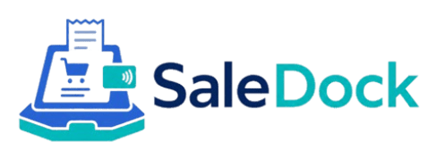
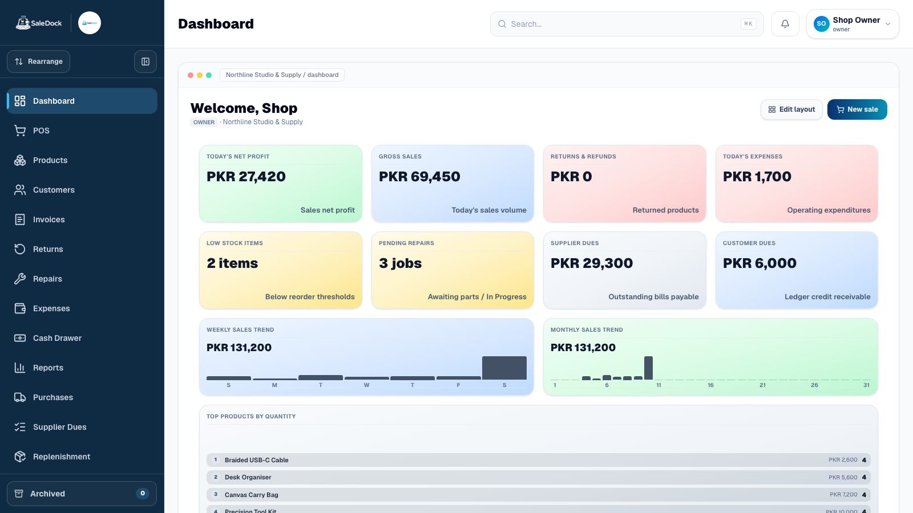
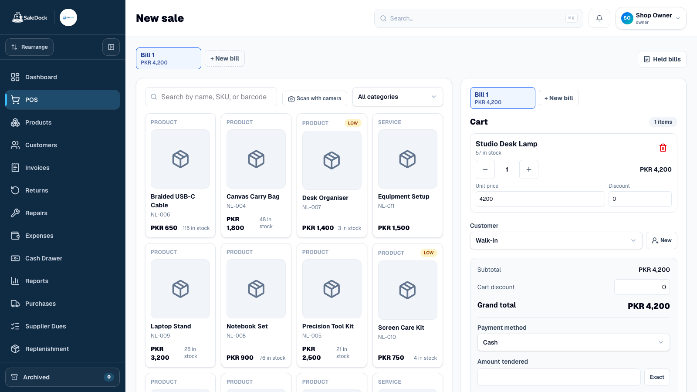
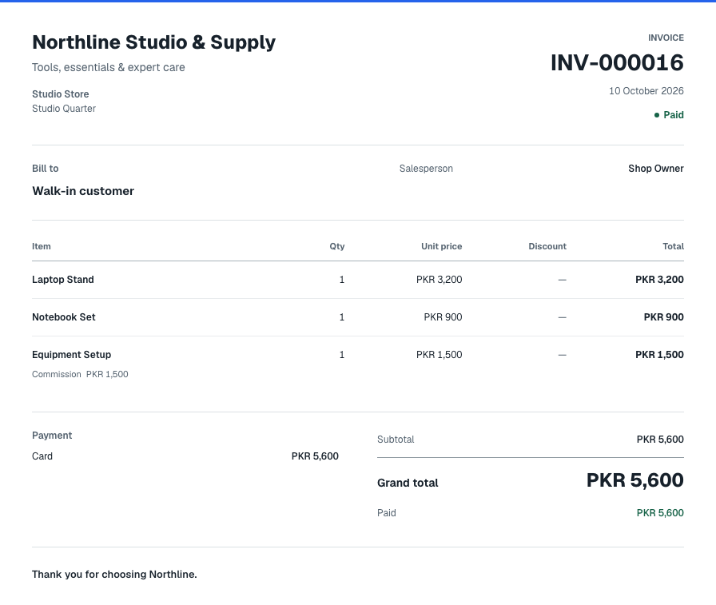
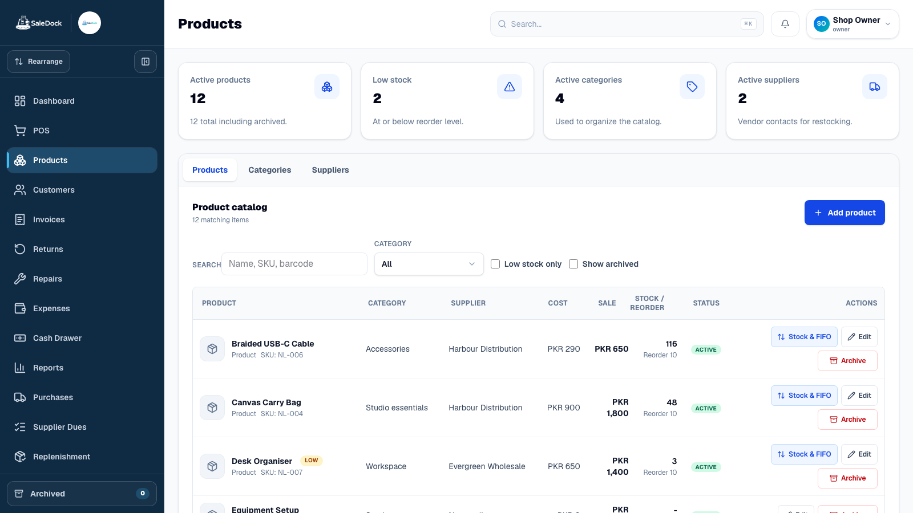
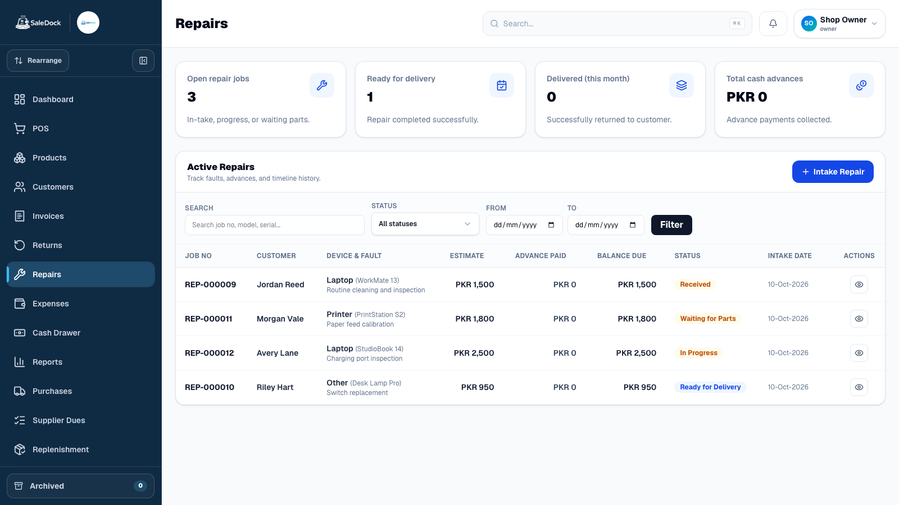
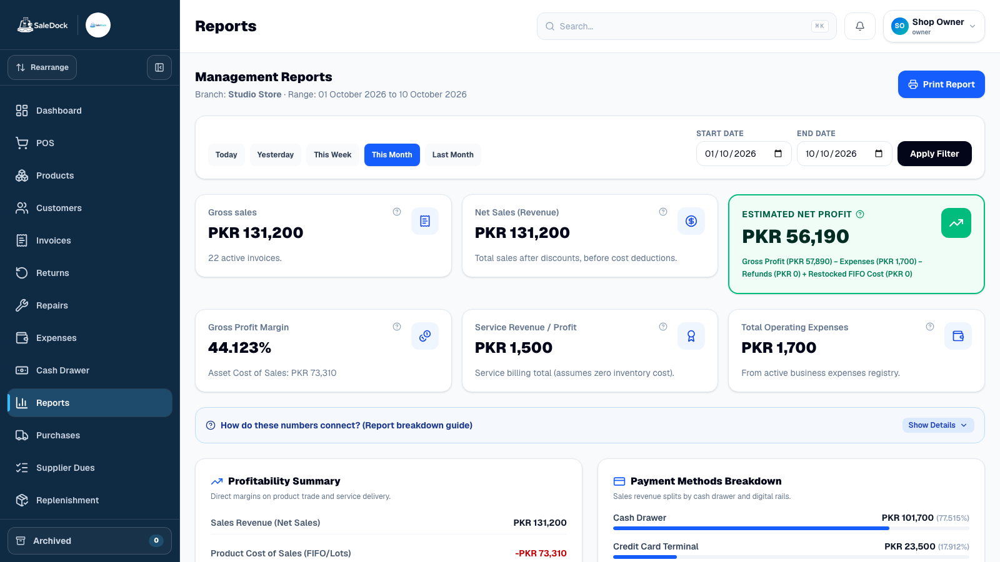

<p align="center">
  
</p>

<h1 align="center">SaleDock</h1>

<p align="center"><strong>Modern cloud POS for retail, service &amp; repair businesses.</strong></p>

<p align="center">Sales, inventory, invoices, customers, suppliers, repairs and reporting.<br />One browser-based workspace.</p>

<p align="center">
  <a href="https://saledock.site">Live App</a> &middot;
  <a href="#see-saledock-in-action">Product Tour</a> &middot;
  <a href="#capabilities">Features</a> &middot;
  <a href="#tech-stack">Tech Stack</a> &middot;
  <a href="#run-saledock-locally">Getting Started</a>
</p>

<p align="center">
  <a href="https://github.com/starwalker12/saledock-cloud-pos/actions/workflows/ci.yml"></a>
  <a href="https://nextjs.org"></a>
  <a href="https://www.typescriptlang.org"></a>
  <a href="https://supabase.com"></a>
  <a href="https://tailwindcss.com"></a>
  <a href="./LICENSE"></a>
</p>

[](docs/assets/readme/saledock-dashboard.png)

<p align="center"><sub>Actual SaleDock screens. Fictional business data, captured in a local workspace.</sub></p>

## Why SaleDock

**Checkout without the extra tabs.** Sell products and services, select a customer, apply permitted discounts and record payment in the same POS.

**Inventory that follows the sale.** Track stock lots, FIFO costs, supplier purchases, adjustments and low-stock items alongside the catalog.

**Customer and supplier money, together.** Keep outstanding balances, settlements and financial history close to the work that created them.

**More than a retail counter.** Handle repair jobs, service charges, expenses, cash shifts and daily closing from the same workspace.

**Documents worth handing over.** Business-branded A4 invoices, PDF printing, 80mm receipts and invoice image sharing give customers a clear record.

**A workspace for the team.** Owner, Admin, Manager, Cashier and Technician roles keep operational access scoped to the job.

## See SaleDock in action

Click any screen to see it at full resolution.

<table>
  <tr>
    <td width="50%"><a href="docs/assets/readme/saledock-dashboard.png"></a><br /><strong>Dashboard</strong><br />Sales, profit, stock and repairs at a glance.</td>
    <td width="50%"><a href="docs/assets/readme/saledock-pos.png"></a><br /><strong>Point of sale</strong><br />A focused catalog-to-payment workspace.</td>
  </tr>
  <tr>
    <td><a href="docs/assets/readme/saledock-invoice.png"></a><br /><strong>Customer invoices</strong><br />Clear itemization and a polished payment summary.</td>
    <td><a href="docs/assets/readme/saledock-inventory.png"></a><br /><strong>Products &amp; inventory</strong><br />Pricing, availability and direct FIFO stock access.</td>
  </tr>
  <tr>
    <td><a href="docs/assets/readme/saledock-repairs.png"></a><br /><strong>Repairs</strong><br />Follow each job from intake to delivery.</td>
    <td><a href="docs/assets/readme/saledock-reports.png"></a><br /><strong>Reports</strong><br />Review performance with business context.</td>
  </tr>
</table>

## Capabilities

| Workspace | What you can do |
| --- | --- |
| **Sales & checkout** | Product and service carts; held bills; permitted discounts; cash and digital payment methods. |
| **Inventory & purchasing** | Atomic opening stock; FIFO lots; restock and adjustments; supplier purchases and replenishment. |
| **Customers & suppliers** | Customer accounts; outstanding balances; payments and write-offs; supplier dues and ledger history. |
| **Services & repairs** | No-stock services; principal/commission capture for financial services; repair intake, status and payment tracking. |
| **Invoices & returns** | A4/PDF and 80mm output; invoice-linked returns; WhatsApp messages and invoice images; optional location QR. |
| **Cash & expenses** | Cash-shift workflows; categorized expenses; daily closing and reconciliation. |
| **Reports & operations** | Sales and profit; service commissions; stock valuation; purchases and loss/override visibility. |
| **Staff & permissions** | Five staff roles; scoped permissions; staff invites; sensitive-event audit logs. |
| **Branding & localization** | Business and invoice branding; English, Urdu and Roman Urdu; light/dark appearance and sidebar themes. |
| **Backup & data safety** | Native backup/export; validated staged restore for eligible accounting backups; checked Owner Factory Reset. |

## Built for business-critical data

SaleDock validates checkout on the server and commits stock and accounting updates transactionally. FIFO allocations retain the original cost source, while organization-scoped access keeps tenant data separated.

New approved sales and receipts have protected source evidence. New customer and supplier ledger postings have an ordered, forward-trusted balance history. Existing and imported history remains readable without being retroactively claimed as trusted.

Backup restore validates eligible accounting data before atomic finalization. These are implemented safeguards, not a claim of certification.

## Tech stack

**Next.js 16** · **React 19** · **TypeScript** · **Tailwind CSS 4** · **Supabase** · **PostgreSQL** · **Vercel**

Zod validates inputs; date-fns supports dates; JSZip and sql.js support backup tooling; ZXing powers barcode scanning; next-themes manages appearance. See [package.json](package.json).

### Architecture at a glance

```text
Browser workspace
       |
Next.js App Router + Server Actions
       |
Validated financial / inventory RPC boundaries
       |
Supabase Auth + PostgreSQL + Storage
       |
Organization-scoped data + Row Level Security
```

## Run SaleDock locally

Use **Node.js 20.9+** and npm. CI uses Node 20. You need your own Supabase environment with repository migrations applied and Auth providers configured.

```bash
npm install
cp .env.example .env.local
# Fill .env.local with your own Supabase values.
npm run dev
```

Open [localhost:3000](http://localhost:3000). Use a local/isolated database for development and testing.

<details>
<summary><strong>Architecture notes</strong></summary>

- Multi-tenancy is based on `organizations`, `branches`, and `profiles`.
- Business data is scoped by `organization_id`; branch-aware data also uses `branch_id`.
- Supabase Row Level Security protects organization-scoped tables. App code also applies organization filters where needed.
- Auth uses Supabase email/password and Google OAuth flows.
- Staff invites are sent through Supabase Auth admin invite APIs.
- reCAPTCHA v2 protects public auth forms when configured.
- The server-only Supabase service-role client is guarded by `server-only` and must never be imported into client components.
- Next.js 16 uses `src/proxy.ts` instead of the older `middleware.ts` convention. This proxy calls `src/lib/supabase/session-update.ts` to refresh Supabase sessions and redirect unauthenticated users away from protected routes.
- The core checkout RPC is defined in Supabase migrations and is intentionally server-side so browser cart values are treated as hints, not trusted totals.
- Static public assets receive long-lived cache headers in `next.config.ts`; dynamic app pages and business data are not cached this way.

Further reading: [architecture](docs/architecture.md), [auth/onboarding](docs/auth-onboarding.md), [security](docs/security-hardening.md) and [privacy](docs/gdpr-baseline.md).

</details>

<details>
<summary><strong>Environment variables</strong></summary>

These are the environment variable names read by the current codebase. Do not put secret values in the README, issues, commits, or logs.

| Name | Purpose |
| --- | --- |
| `NEXT_PUBLIC_SUPABASE_URL` | Public Supabase project URL used by browser and server Supabase clients. |
| `NEXT_PUBLIC_SUPABASE_ANON_KEY` | Public Supabase anon key used by browser and server Supabase clients. |
| `SUPABASE_SERVICE_ROLE_KEY` | Server-only Supabase service-role key for trusted admin/bootstrap workflows. |
| `NEXT_PUBLIC_APP_NAME` | Public app name used by environment parsing; defaults to SaleDock Cloud POS in code. |
| `PLATFORM_ADMIN_EMAILS` | Optional comma-separated fallback list for platform admin access. |
| `NEXT_PUBLIC_GOOGLE_SITE_VERIFICATION` | Optional Google site verification meta value. |
| `NEXT_PUBLIC_RECAPTCHA_SITE_KEY` | Public Google reCAPTCHA v2 site key for auth pages. |
| `RECAPTCHA_SECRET_KEY` | Server-only Google reCAPTCHA secret used to verify auth form tokens. |
| `NEXT_PUBLIC_GA_MEASUREMENT_ID` | Optional Google Analytics 4 measurement ID, loaded only after analytics consent is accepted. |
| `NEXT_PUBLIC_CLARITY_PROJECT_ID` | Optional Microsoft Clarity project ID, loaded only after analytics consent is accepted. |
| `NODE_ENV` | Runtime mode used by Next.js and development-only safeguards; normally set by the runtime. |

Google OAuth client secrets are configured in Supabase Auth provider settings, not in this repository. Never commit `.env.local`, provider credentials, keys or tokens.

</details>

<details>
<summary><strong>Scripts and checks</strong></summary>

| Script | Command | Description |
| --- | --- | --- |
| `dev` | `next dev` | Start the development server. |
| `build` | `next build` | Build the production app. |
| `start` | `next start` | Start a production build locally. |
| `lint` | `eslint` | Run ESLint. |
| `typecheck` | `tsc --noEmit` | Run TypeScript type checking. |
| `format` | `prettier --write .` | Format files with Prettier. |
| `qa:e2e` | `playwright test` | Run browser tests. |
| `qa:e2e:headed` | `playwright test --headed` | Run browser tests visibly. |
| `qa:e2e:ui` | `playwright test --ui` | Open the Playwright UI. |

See [local QA guidance](docs/qa-playwright.md).

</details>

<details>
<summary><strong>Project structure</strong></summary>

```text
src/app/                         Next.js App Router routes and server actions
src/app/pos/                     POS checkout UI and checkout actions
src/app/dashboard/               Dashboard page and draggable stat-card layout
src/app/settings/                Settings, backup/restore, privacy and security
src/components/layout/           App shell, sidebar, topbar, mobile drawer
src/components/ui/               Reusable UI components such as stat cards
src/components/auth/             reCAPTCHA client component
src/lib/auth/                    Session, identity, captcha-pass, rate-limit helpers
src/lib/data/                    Server-side data access modules
src/lib/supabase/                Browser, server, admin, and session-update Supabase clients
src/lib/validation/              Zod schemas for business workflows
src/lib/i18n/                    English, Urdu, and Roman-Urdu dictionaries/providers
supabase/migrations/             Postgres schema, RLS, RPCs, and business-rule migrations
supabase/seed.sql                Seed data
public/                          Static assets served by the app
docs/                            Project notes and feature/security documentation
.github/workflows/ci.yml         Lint, typecheck, and build CI workflow
```

</details>

<details>
<summary><strong>Deployment</strong></summary>

The production app is hosted on Vercel. The default branch is `main`, and pushes to `main` auto-deploy to production.

Production URLs:

- `https://saledock.site`
- `https://saledock-cloud-pos.vercel.app`

The GitHub Actions workflow runs on pull requests and pushes to `main`:

```bash
npm ci
npm run lint
npm run typecheck
npm run build
```

Configure the same environment variable names in Vercel. Store real secret values only in the Vercel dashboard, local `.env.local`, or the appropriate provider dashboard.

</details>

<details>
<summary><strong>Database and business rules</strong></summary>

Database schema changes live in `supabase/migrations`. The migrations define the tenant model, business tables, RLS policies, checkout RPCs, stock/FIFO behavior, customer/supplier ledgers, returns/refunds, repairs, privacy requests, shifts, staff permissions, login rate limiting, and reporting RPCs.

Apply migrations through your normal Supabase workflow. Do not run migrations against production without review.

### Important business rules

- POS totals are recomputed server-side.
- Stock changes are transactional and use FIFO stock lots for product cost allocation.
- Service principal is pass-through money; service commission is the profit.
- Supplier payments are money movement, not an additional product cost.
- Customer balances are tracked through ledger-style entries and explicit direction/type semantics.
- Historical invoices and reports should remain stable after later catalog or cost changes.
- Tenant isolation by `organization_id` must not regress.
- Authoritative debt movements and current outstanding balances use exact two-decimal money. Meaningful sub-paisa inputs are rejected, not silently rounded.
- Forward ledger/source trust applies only to approved new postings, not reconstructed or imported history.

Read [business rules](docs/business-rules.md), [services](docs/service-transactions.md), [customer settlements](docs/customer-settlement-accounting.md), [supplier purchases](docs/supplier-purchases.md), [backup/restore](docs/backup-import-export.md), [daily closing](docs/daily-closing.md) and [invoice sharing](docs/receipts-whatsapp.md).

Demo Data creation/removal is retired. Current safety boundaries are documented in [demo retirement](docs/qa/demo-data-retirement-prerequisite.md), [forward ledger trust](docs/qa/forward-trusted-ledger-posting.md) and [posted evidence protection](docs/qa/posted-sale-receipt-evidence-protection.md). Older planning documents may describe historical scope; current source and migrations are authoritative.

</details>

### Repository notes

- This repository is public, but `package.json` is marked private to prevent accidental npm publishing.
- Keep secrets out of source control. Environment variable names are safe to document; values are not.

## License

SaleDock is open source under the [MIT License](./LICENSE).
