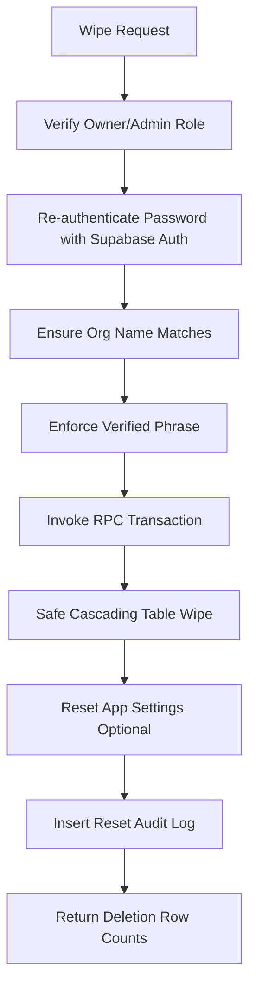

# Restore Factory Defaults / Factory Reset

The **Restore Factory Defaults / Factory Reset** module provides an Owner and Admin-scoped tool inside the online POS to wipe historical business data securely for the current organization while maintaining structural, identity, and security safety boundaries.

---

## 🔒 Security Hardening & Gatekeepers

To prevent accidental triggers or malicious sweeps, the factory reset process enforces the following validation checks:

1. **Role Access Restriction**:
   * Enforced strictly server-side. Only users registered as `owner` or `admin` role are permitted.
2. **Re-Authentication of Current Session**:
   * The active user must enter their current login password. This password is verified server-side directly against the Supabase Auth system (`supabase.auth.signInWithPassword`) to re-confirm identity before any transactional wipe.
3. **Double Confirmations**:
   * Checks mandatory acknowledgement checkboxes:
     * *I downloaded/saved the safety backup.*
     * *I understand this operation cannot be undone.*
     * *I understand all staff logs, repairs, sales, and catalog rows will be removed.*
4. **Validation Fields**:
   * **Organization Name**: The user must type their exact Organization Name (e.g. `Gadget Zone`).
   * **Verification Phrase**: The user must type the exact string: `RESTORE FACTORY DEFAULTS`.

---

## 💾 Pre-Reset Safety Backup Enforcer

* The wizard stepper prevents final confirmation until the operator executes the **Download Pre-Reset Backup** action.
* Clicking the download triggers a full client-side JSON/CSV `.zip` export containing all active database tables (Categories, Suppliers, Products, Invoices, Repairs, Ledger rows, etc.) to guarantee that historical data can be recovered or referenced offline if needed.
* An audit log event `backup.pre_reset_export_created` is registered at this step.

---

## ⚙️ Technical Deletion Flow

Once verified, the server action invokes the Postgres RPC function `reset_organization_to_factory_defaults`:

### 1. Database Cascading Deletion Order
The function clears rows strictly bounded by `organization_id` using a safe cascade sequence to satisfy database foreign key integrity:
1. `return_stock_allocations`
2. `return_items`
3. `returns`
4. `invoice_item_stock_allocations`
5. `stock_movements`
6. `product_stock_lots` (FIFO batches)
7. `payments`
8. `invoice_items`
9. `invoices`
10. `customer_ledger_entries`
11. `repair_status_history`
12. `repairs`
13. `expenses`
14. `daily_closings`
15. `products`
16. `product_categories`
17. `suppliers`
18. `customers`
19. `import_row_mappings`
20. `import_jobs`

### 2. What is Preserved
* **Auth Credentials**: Raw logins and user accounts in `supabase.users` are **never** deleted.
* **Profiles**: The active Owner and Admin profiles remain fully intact.
* **Tenancy**: The parent `organizations` row and `branches` tables are preserved.
* **Final Audit Event**: A final log entry `settings.factory_reset_completed` is injected to maintain a permanent audit trail.

---

## 📈 Audit Event Log

Every reset operation registers clear activity markers in the system logs:
* `backup.pre_reset_export_created`: Recorded when the pre-reset safety backup archive download is initiated.
* `settings.factory_reset_completed`: Recorded once the Postgres RPC finishes wiping all organization datasets.
