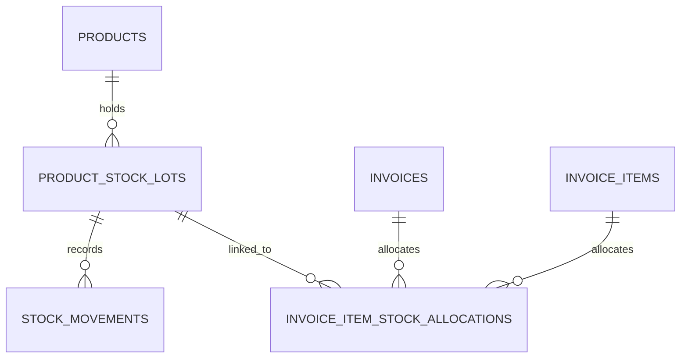

# Inventory FIFO & Stock Lots Roadmap

This document outlines the architecture, database schema, and workflows to migrate the Gadget Zone Online POS from a simple product stock decrement to a proper, robust, and double-entry FIFO inventory tracking system.

## 1. Current Simple Stock Behavior
- `public.products` contains a simple `stock_quantity` integer column.
- During POS checkout (`public.pos_checkout` RPC function), physical product stock is decremented directly in the product row under a lock (`FOR UPDATE`).
- Services are ignored and do not affect stock.
- Standard purchase cost is cached per product, and `invoice_items.purchase_price` is stored as a simple snapshot from `products.purchase_price` at the time of sale. This makes profit margins rough and inaccurate when wholesale prices fluctuate.

## 2. Target Parity Behavior (FIFO Stock Lots)
To match the offline desktop app's precision, we are introducing three new tables:
1. **`product_stock_lots`**: Batches or stock lots representing inventory purchases or restocks with a specific unit cost, supplier, received date, and remaining count.
2. **`stock_movements`**: A complete, double-entry transactional ledger of all stock additions, deductions, sales, returns, and manual adjustments.
3. **`invoice_item_stock_allocations`**: A link table that records exactly how many items from which specific stock lot were allocated to an invoice line during checkout. This preserves FIFO trace history for returns, refunds, and actual profit margin calculations.

### FIFO Checkout Allocation Workflow
When a checkout is processed via `pos_checkout`:
1. Physical products are processed. For each item:
2. The product row is locked.
3. The oldest active stock lots (`quantity_remaining > 0`) for that product are queried and locked `FOR UPDATE`, ordered by `purchase_date ASC, created_at ASC`.
4. We verify the sum of `quantity_remaining` across all active lots is sufficient.
5. We consume stock from the oldest lots first:
   - For each lot consumed, we decrement `quantity_remaining` and create a row in `invoice_item_stock_allocations`.
   - We write a corresponding `sale` `stock_movements` row referencing the lot.
6. The product's overall `stock_quantity` cache is decremented.
7. `invoice_items.purchase_price` is computed as a **weighted average** of the unit costs of the allocated lots, ensuring 100% accurate profit margins in reports!

---

## 3. Database Schema Design

### A. product_stock_lots
Tracks batches of stock received.
- `id` (uuid, PK)
- `organization_id` (uuid, REFERENCES organizations)
- `branch_id` (uuid, REFERENCES branches)
- `product_id` (uuid, REFERENCES products)
- `supplier_id` (uuid, REFERENCES suppliers, nullable)
- `lot_number` (text, nullable)
- `purchase_date` (date, nullable)
- `quantity_received` (integer >= 0)
- `quantity_remaining` (integer >= 0)
- `unit_cost` (numeric(12,2) >= 0)
- `notes` (text, nullable)
- `is_active` (boolean, default true)
- `created_by` (uuid, REFERENCES profiles, nullable)
- `created_at` (timestamptz)
- `updated_at` (timestamptz)

### B. stock_movements
Double-entry signed stock ledger.
- `id` (uuid, PK)
- `organization_id` (uuid, REFERENCES organizations)
- `branch_id` (uuid, REFERENCES branches)
- `product_id` (uuid, REFERENCES products)
- `stock_lot_id` (uuid, REFERENCES product_stock_lots, nullable)
- `movement_type` (text enum: `purchase`, `sale`, `return_in`, `return_out`, `adjustment_in`, `adjustment_out`, `opening_stock`, `void`)
- `quantity` (integer, positive quantity representing the absolute change; direction is defined by the type)
- `unit_cost` (numeric(12,2), nullable)
- `reference_type` (text, e.g. 'invoice', 'adjustment', nullable)
- `reference_id` (uuid, nullable)
- `invoice_id` (uuid, REFERENCES invoices, nullable)
- `invoice_item_id` (uuid, REFERENCES invoice_items, nullable)
- `notes` (text, nullable)
- `created_by` (uuid, REFERENCES profiles, nullable)
- `created_at` (timestamptz)

### C. invoice_item_stock_allocations
FIFO audit record linking sold items to their cost batches.
- `id` (uuid, PK)
- `organization_id` (uuid, REFERENCES organizations)
- `invoice_id` (uuid, REFERENCES invoices)
- `invoice_item_id` (uuid, REFERENCES invoice_items)
- `product_id` (uuid, REFERENCES products)
- `stock_lot_id` (uuid, REFERENCES product_stock_lots)
- `quantity` (integer > 0)
- `unit_cost` (numeric(12,2) >= 0)
- `created_at` (timestamptz)

---

## 4. UI Integration & Operations

### 1. Stock Lots & Movement History in Product Detail
- Inside the catalog, every physical product gets an "Inventory Management" expander.
- It displays a table of active **Stock Lots** (showing lot number, cost, initial received, current remaining, and date).
- It displays a chronological ledger of **Stock Movements** showing additions, sales, and manual audits.
- Users with cashier access can only view this history.
- Users with Owner, Manager, or Admin permissions can:
  - Add a **New Purchase/Restock Lot** (which increments `products.stock_quantity`, creates a new lot, and writes an `purchase` movement).
  - Record a **Manual Stock Adjustment** (with choices `Adjustment In` or `Adjustment Out` and a mandatory reason field, creating a movement and editing the latest lot/remaining count).

### 2. Invoice Profit Reports
- Profit margin summaries on invoices are calculated securely:
  `profit = sum(line_total - (allocated_cost * qty))`
- Visible only to owner, admin, or manager roles via simple role check.
- Cashiers and viewers will never see product costs or margins.

### 3. Returns / Refunds
- Migration `0006_returns_refunds.sql` restores returned products to the original FIFO lots recorded in `invoice_item_stock_allocations`.
- Restocked returns create `stock_movements` rows with `movement_type = 'return_in'`.
- `return_stock_allocations` stores the return-to-lot trace so future returns cannot restore more than the original sold allocation.
- Services and non-restocked product returns do not create stock movements.
