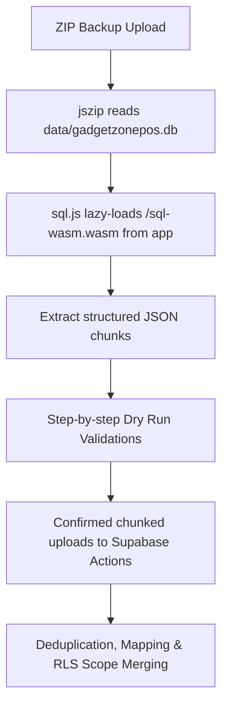

# Offline Desktop Backup ZIP Import / Restore

This document serves as the guide for the Offline Desktop Backup ZIP Import / Restore system built for the Gadget Zone Online POS system.

---

## 🚀 Architectural Overview

To prevent heavy server binary compilations and eliminate Vercel serverless timeout failures, the current desktop backup flow previews SQLite files in the browser and keeps the destructive import path disabled until explicitly approved:

### 1. Dynamic Browser-Side SQLite Reader
* Offloads CPU-intensive database parsing to browser WebAssembly using a dynamically loaded `sql.js` instance.
* Serves the SQLite WASM parser from `public/sql-wasm.wasm` as `/sql-wasm.wasm` instead of a CDN, avoiding production fetch failures and keeping the parser available on Vercel Preview and Production.
* Before parsing a desktop ZIP, the UI probes `/sql-wasm.wasm`; if the asset is missing, the error includes the uploaded file name, detected backup type, WASM path used, and the clear note that no data was imported.

### 2. Relation Preservation Mapping
* Maps SQLite primary keys to Supabase UUID fields dynamically using the `import_row_mappings` index.
* Resolves foreign key hierarchies (such as mapping inventory lots to products, invoice items to transactions, and repair history logs to customers).

### 3. Progressive Chunking
* Batches database tables in groups of 100 rows per transaction to comply with serverless payload constraints and bypass server timeout parameters.

---

## 🛠️ Step-by-Step Stepper Wizard

Located under **Settings → Backup & Restore**:

1. **Upload**: Drop-zone accept. Checks for `manifest.json`, online JSON payloads, and nested `data/gadgetzonepos.db` files.
2. **Preview**: Scans metadata and showcases absolute row counts across all 17 supported tables.
3. **Configuration**: Option to apply safe brand details (shop support phones, repair terms).
4. **Dry Run**: Evaluates structural constraints, orphaned lots, invalid prices, and counts warnings before making database writes.
5. **Confirmation**: Strict warning checklist + typing `IMPORT DESKTOP BACKUP` and checking risk acknowledgements.
6. **Progress**: Reserved for the future approved import flow.
7. **Report**: Reserved for the future approved import flow.

Online backup ZIP files with `data/gadgetzone-online.json` are inspected directly and do not initialize SQLite/WASM. Desktop ZIP files, including nested desktop exports, use the local WASM parser only for preview/count inspection. Missing `manifest.json` is handled by inferring desktop metadata from the SQLite database, not by failing the upload.

---

## 🔒 Security & Data Hardening

> [!IMPORTANT]
> **Auth Exclusions:**
> - To safeguard customer accounts, **raw passwords, password hashes, recoveries, and access tokens are completely ignored**.
> - Real user login credentials must be created by owners or admins under the **User Management** page.
>
> **RLS Boundary Enforcement:**
> - Every insertion query inherits RLS scopes matching the current active cashier's `organization_id` to ensure no cross-tenant data leak occurs.

---

## Orphan-row Detection in the Restore Wizard

The dry-run step now detects rows in the desktop SQLite that reference missing parent rows (a common artifact of testing on the desktop where customers/returns get deleted without cascading). When any orphans are found:

- A red card appears with one row per table, showing **count**, **missing source IDs**, and **recommended action**.
- The Confirm Import button is disabled until the operator chooses:
  - **Drop orphan rows and continue import** — orphans are filtered out, reported separately under *Skipped orphan*.
  - **Stop import and fix the desktop backup first** — import is disabled entirely.
- The chosen policy is also enforced server-side inside `importTableChunkAction`. Missing or wrong policy → server refuses the chunk with a clear error.
- Audit job manifest now records `OnlineImport.orphanPolicy` + per-table `orphanFindings`.

No placeholder customers/returns are auto-created.
