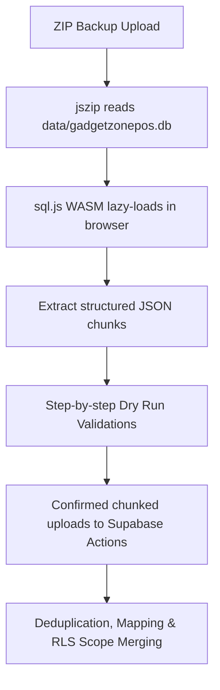

# Offline Desktop Backup ZIP Import / Restore

This document serves as the guide for the Offline Desktop Backup ZIP Import / Restore system built for the Gadget Zone Online POS system.

---

## 🚀 Architectural Overview

To prevent heavy server binary compilations and eliminate Vercel serverless timeout failures, the import flow runs entirely using a client-server coordinated chunking process:

### 1. Dynamic Browser-Side SQLite Reader
* Offloads CPU-intensive database parsing to browser WebAssembly using a dynamically loaded `sql.js` instance.
* Locates and fetches WASM modules on-demand, keeping Next.js bundle sizes extremely lightweight.

### 2. Relation Preservation Mapping
* Maps SQLite primary keys to Supabase UUID fields dynamically using the `import_row_mappings` index.
* Resolves foreign key hierarchies (such as mapping inventory lots to products, invoice items to transactions, and repair history logs to customers).

### 3. Progressive Chunking
* Batches database tables in groups of 100 rows per transaction to comply with serverless payload constraints and bypass server timeout parameters.

---

## 🛠️ Step-by-Step Stepper Wizard

Located under **Settings → Backup & Restore**:

1. **Upload**: Drop-zone accept. Checks for `manifest.json` and parses `data/gadgetzonepos.db`.
2. **Preview**: Scans metadata and showcases absolute row counts across all 17 supported tables.
3. **Configuration**: Option to apply safe brand details (shop support phones, repair terms).
4. **Dry Run**: Evaluates structural constraints, orphaned lots, invalid prices, and counts warnings before making database writes.
5. **Confirmation**: Strict warning checklist + typing `IMPORT DESKTOP BACKUP` and checking risk acknowledgements.
6. **Progress**: Displays real-time progress bars as chunks upload sequentially.
7. **Report**: Generates clear final tables mapping inserted, skipped (deduplicated), and failed counts.

---

## 🔒 Security & Data Hardening

> [!IMPORTANT]
> **Auth Exclusions:**
> - To safeguard customer accounts, **raw passwords, password hashes, recoveries, and access tokens are completely ignored**.
> - Real user login credentials must be created by owners or admins under the **User Management** page.
>
> **RLS Boundary Enforcement:**
> - Every insertion query inherits RLS scopes matching the current active cashier's `organization_id` to ensure no cross-tenant data leak occurs.
